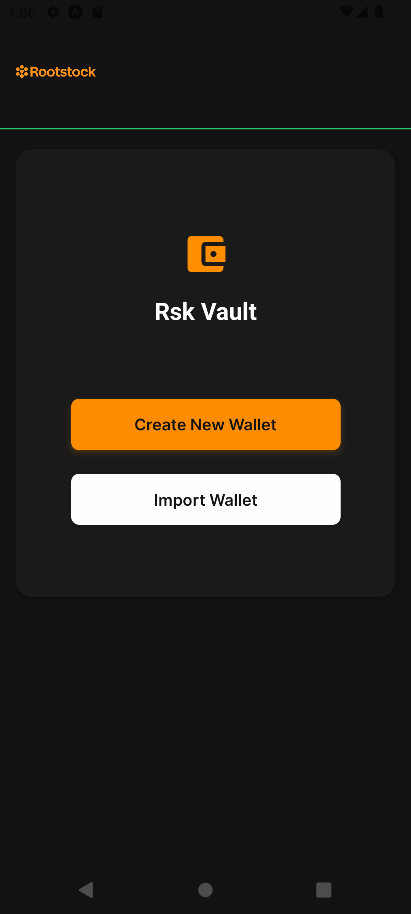

# RSKVault



**RSKVault** is a secure, mobile-first, EVM-compatible crypto wallet built for the Rootstock (RSK) ecosystem using **Expo + React Native**. It empowers users to create, import, and manage Rootstock wallets directly on their device, with strong client-side encryption and no backend dependencies.

> ⚠️ **Disclaimer:** This app is for educational and development purposes. Do **not** use it to store real assets.

---

## ✨ Features

- **Mobile-First**: Built with Expo and React Native for iOS and Android.
- **Rootstock Native**: First-class support for Rootstock Mainnet and Testnet.
- **Mnemonic Encryption**: Wallet mnemonics are AES-encrypted with a password-derived key and stored securely on-device.
- **Wallet Management**:
  - Create new Rootstock wallets.
  - Import existing wallets via 12-word mnemonic.
- **Custom Tokens**: Add any ERC-20 token by address(Optional).
- **Biometric Authentication**: Optionally unlock your wallet with FaceID/TouchID.
- **Security-First**:
  - PBKDF2 key derivation and AES encryption.
  - All sensitive data stored locally (Expo SecureStore & SQLite).
- **Modern UI**: Clean, intuitive interface for seamless wallet management.

---

## Tech Stack

- [React Native](https://reactnative.dev/)
- [Expo](https://expo.dev/)
- [Ethers.js](https://docs.ethers.io/)
- [Wagmi](https://wagmi.sh/)
- [Viem](https://viem.sh/)
- [Expo SecureStore](https://docs.expo.dev/versions/latest/sdk/securestore/)
- [Expo SQLite](https://docs.expo.dev/versions/latest/sdk/sqlite/)
- [WalletConnect](https://walletconnect.com/)

---

## Getting Started

### Prerequisites

- Node.js ≥ 18
- npm or yarn
- Expo CLI (`npm install -g expo-cli`)

### Installation

```sh
git clone https://github.com/smartdevs17/rskvault.git
cd rskvault
npm install
expo start
```

---

## How It Works

### Mnemonic Encryption Flow

1. User sets a password when creating/importing a wallet.
2. A PBKDF2-derived key is generated from the password.
3. The mnemonic is AES-encrypted and stored securely on-device.
4. On unlock, the mnemonic is decrypted using the password or biometrics.

### Local Storage

- Uses Expo SecureStore and SQLite for secure, persistent storage.
- No wallet data ever leaves your device.

### Token Management

- Add any ERC-20 token by address.
- View balances and send tokens on Rootstock Mainnet/Testnet.

---

## Supported Networks

- **Rootstock Mainnet**
- **Rootstock Testnet**

(You can easily extend support to other EVM-compatible chains.)

---

## Why RSKVault?

RSKVault is designed to showcase how easy and secure it is to build mobile wallets for the Rootstock ecosystem. It’s a great starting point for developers looking to build dApps, wallets, or DeFi tools on RSK.

- **Promote Rootstock**: Encourage app development and experimentation on the RSK network.
- **Learn by Example**: See how to integrate RSK with modern React Native tooling.
- **Open Source**: Fork, extend, and contribute to help grow the Rootstock ecosystem!

---

## Potential Features / Contributions

- Transaction History Viewer
- dApp Connector (WalletConnect)
- QR Code-based Wallet Import/Export
- Token Price Fetching (CoinGecko API)
- Hardware Wallet Integration
- Encrypted Mnemonic Backup/Restore

Feel free to fork or open a PR with your ideas!

---

## Contribution Guide

1. Fork the repo.
2. Create your feature branch: `git checkout -b feature/awesome-feature`
3. Commit your changes: `git commit -am 'Add awesome feature'`
4. Push to the branch: `git push origin feature/awesome-feature`
5. Open a Pull Request 🚀

---

## About Rootstock

[Rootstock (RSK)](https://rootstock.io/) is the first open-source smart contract platform secured by the Bitcoin Network. RSK brings EVM-compatible smart contracts and DeFi to Bitcoin, enabling a new wave of decentralized applications.

---

## A Note from the Author

> RSKVault is built to inspire and accelerate Rootstock app development. Explore, learn, and help grow the Rootstock ecosystem. For feedback, open an issue or connect on GitHub.

---

**Build the future of Bitcoin DeFi with Rootstock and RSKVault!**